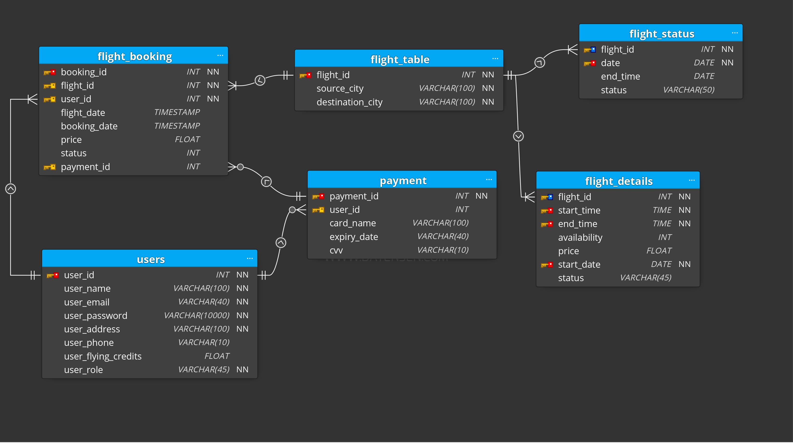
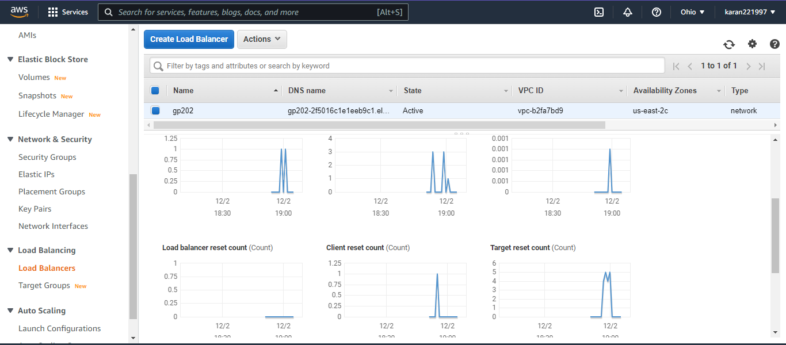

# Airline Management System(Team-project-muskers)

# Team Members:
1. Karan Pinakinbhai Jariwala (015214446)
2. Geetika Kapil (01523348)
3. Alihussain Ladiwala (015215811)
4. Sai Nikhil Yandamuri (015229071)

# Tools and Languages:

* Frontend - React 
* Backend - Nodejs, Expressjs 
* Database - MySQL 
* API Testing - Postman 
* Cloud - Amazon Web Services

# Scrum Tool:
* Jira

# Scrum meetings schedule:
* Monday
* Saturday

# Tasks 
 
* Frontend and deployment : Alihussain Ladiwala, Geetika Kapil
* Backend and Database  : Sai Nikhil Yandamuri, Karan Pinakinbhai Jariwala
   
# Architectural Diagram:

# Database Design:

# Component Diagram:

# Deplyment Diagram:

# Deplyment Diagram:
* Created 2 instances and deployed application on both of them.

* Created load balancer and added those 2 instances in it.

# Extreme programming (XP) Core Values Implemented:
* Simplicity
  * We used a critical eye to determine the most important aspects of the project scope and only did what was required.
  * As we introduced new APIs and matching UI components, actively striving to eliminate duplications helped us keep our code simple to maintain.
  * We made sure that the names of all classes, methods, and variables were explicit and disclosed the goal.

* Feedback
  * During the early development and testing phase, feedback was crucial. We made it a point to pay attention to everyone's suggestions without interrupting them.
  * We had a built-in 20-minute feedback session at the conclusion of every meeting to check on what went according to plan and what needed to be fixed in the future.
  * We tested features made by other team members and provided comments to each other during the testing process. It aided us in locating the bugs.
  * We were able to identify barriers, improve, and perform better as a result of the feedback we received.

* Respect
  * Within the team, the basic concept of respect creates a healthy and happy environment.
  * We made it a top priority to treat everyone in the team with respect. With brainstorming meetings, each member was given encouragement for all of their ideas. It was critical to listen to the issues and assist each team member in any manner possible.
  * We took into account all of the feedback or review remarks provided by each team member, and we had no doubts about their talents.

# Design Decisions:

## Architecture-level:
1. MERN stack.
2. Separate deployment environments for frontend and backend applications.

## Application Design-level:
1. Leveraging nodeJS and Express design patterns to design APIs. These design patterns helped us add new APIs relatively easily.

## Business-level: 
Below listed are decisions/use cases considered for features provided by the online banking application: 
### Admin features:
1. Register and Login Admin
2. Admin creates Flights
3. Admin Updates status of the flight
4. View Flights

### User features:
1. Registration and Login of User
2. Search for Flights
3. Book Flight
4. Add Payment information
5. View Bookings
6. Cancel Bookings

# Sprint Journal:

## Sprint Sheet
https://github.com/gopinathsjsu/team-project-muskeers/blob/master/documentation/Sprint%20Sheet.xlsx

